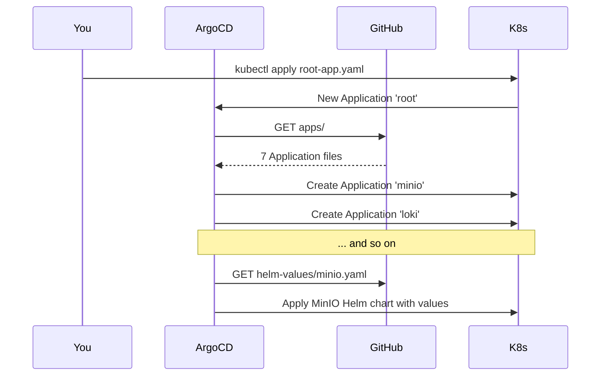

# Bootstrap — first-time install

A step-by-step walkthrough for installing the entire stack on a fresh k3s server. After this is done, ArgoCD takes over and everything is managed via Git pushes.

> [!NOTE]
> **New to Kubernetes?** Read [docs/concepts.md](docs/concepts.md) first — 5 minutes, explains every term used here.

---

## What you'll do

1. Verify your server is ready
2. Push this repo to your GitHub
3. Create namespaces and apply secrets (one-time, manual)
4. Install ArgoCD
5. Hand ArgoCD the "root Application"
6. Watch everything come up
7. Bootstrap the MinIO user that Loki needs
8. Verify everything works

**Time:** ~30 minutes (most of it watching pods come up).

---

## Step 0 — Prereqs

You should have:

- [ ] A Linux server with k3s installed and reachable from your laptop (`kubectl get nodes` returns Ready)
- [ ] `helm` 3.12+ installed (on the server: `curl https://raw.githubusercontent.com/helm/helm/main/scripts/get-helm-3 | bash`)
- [ ] At least 6 Gi free RAM and 90 Gi free disk
- [ ] This repo cloned somewhere on the server (e.g. `~/monitoring-infrastructure`)
- [ ] A GitHub repo to push to. Default in this codebase: `https://github.com/simon-appwrk/monitoring-infrastructure`. If you fork, search-and-replace that URL across [bootstrap/root-app.yaml](bootstrap/root-app.yaml) and [apps/*.yaml](apps/) before pushing.

> [!TIP]
> Verify resources before starting:
> ```bash
> kubectl get nodes                          # k3s ready?
> kubectl get sc                             # 'local-path' default StorageClass present?
> free -h                                    # >= 6Gi free?
> df -h /var/lib/rancher/k3s/storage         # >= 90Gi free?
> helm version                               # 3.12+?
> ```

---

## Step 1 — Push this repo to GitHub

```bash
cd ~/monitoring-infrastructure          # wherever your clone lives
git init
git add .
git commit -m "initial commit"
git branch -M main
git remote add origin https://github.com/simon-appwrk/monitoring-infrastructure.git
git push -u origin main
```

> [!IMPORTANT]
> Verify nothing sensitive got committed:
> ```bash
> git log --all --full-history -- 'secrets/*.yaml'
> ```
> Should return nothing — only `secrets/*.yaml.example` should be tracked. If it returns commits, fix `.gitignore` and rewrite history before pushing publicly.

---

## Step 2 — Create namespaces

ArgoCD will eventually do this for you, but Step 3 (secrets) needs the namespaces to exist already.

```bash
cd ~/monitoring-infrastructure
kubectl apply -f manifests/namespaces.yaml
```

**Expected output:**
```
namespace/obs-metrics created
namespace/obs-logs created
namespace/obs-storage created
namespace/obs-registry created
```

---

## Step 3 — Create and apply secrets

Secrets never go in Git. You create them on the server from templates.

### 3a. Copy each template

```bash
cd ~/monitoring-infrastructure/secrets
for f in *.yaml.example; do
  [[ ! -f "${f%.example}" ]] && cp "$f" "${f%.example}"
done
ls
```

You should now see both `*.yaml.example` (committed) and `*.yaml` (your local, gitignored) versions.

### 3b. Edit each `*.yaml` and replace every `CHANGEME`

```bash
vim minio-root.yaml
vim loki-s3.yaml
vim grafana-admin.yaml
vim grafana-oidc.yaml          # OK to leave placeholder if Keycloak isn't set up yet
vim harbor-admin.yaml
vim harbor-database.yaml
vim alertmanager-webhooks.yaml
```

> [!TIP]
> Generate strong passwords with `openssl rand -base64 32`.

> [!IMPORTANT]
> **Cross-file consistency:** `loki-s3.yaml :: MINIO_SECRET_KEY` is the password for the MinIO user `loki` you'll create in Step 6. Pick a value here and remember it (or just look it up via `kubectl get secret` later).

### 3c. Apply all

```bash
bash apply.sh
```

**Expected output:** the script refuses to run if any file still contains `CHANGEME`, then `kubectl apply`s each one.

```
==> alertmanager-webhooks.yaml
secret/alertmanager-webhooks created
==> grafana-admin.yaml
secret/grafana-admin created
...
Done.
```

---

## Step 4 — Install ArgoCD

```bash
cd ~/monitoring-infrastructure
bash bootstrap/install-argocd.sh
```

This installs ArgoCD via Helm into the `argocd` namespace and exposes the UI on **NodePort 30040**.

**Expected:** you'll see Helm output ending with:
```
==> Done.
Initial admin password:
  kubectl -n argocd get secret argocd-initial-admin-secret -o jsonpath='{.data.password}' | base64 -d ; echo
```

### Get the admin password

```bash
kubectl -n argocd get secret argocd-initial-admin-secret \
  -o jsonpath='{.data.password}' | base64 -d ; echo
```

### Open the UI

In your browser:

```
http://<your-node-ip>:30040
```

User: `admin`. Password: what the command above printed.

> [!TIP]
> If your laptop can't reach the node IP directly, port-forward instead:
> ```bash
> kubectl -n argocd port-forward svc/argocd-server 8080:80
> # Then open http://localhost:8080
> ```

---

## Step 5 — Apply the root Application

This single command tells ArgoCD to start watching this repo:

```bash
kubectl apply -f bootstrap/root-app.yaml
```

**Expected:** `application.argoproj.io/root created`

ArgoCD now:

1. Reads the `apps/` folder of your GitHub repo
2. Finds the 7 Application files
3. Creates each one
4. Each Application starts deploying its workload



---

## Step 6 — Watch everything come up

In one terminal:

```bash
watch 'kubectl get pods -A | grep -E "obs-|argocd"'
```

In another, open the ArgoCD UI (`http://<node>:30040`) — you'll see Apps appear one by one and turn green.

**Typical timing on a 7.7 Gi node:**

| Time     | What's happening                                                  |
|----------|-------------------------------------------------------------------|
| 0:00     | ArgoCD discovers Applications                                     |
| 0:00–2:00 | MinIO Pod pulling image, starting                                |
| 1:00–4:00 | Loki pulling, starting (will fail S3 connection — see Step 7)    |
| 2:00–6:00 | kube-prometheus-stack — biggest install (CRDs + Prom + AM + node-exporter + kube-state-metrics) |
| 5:00–7:00 | Grafana pulling, starting                                         |
| 5:00–10:00 | Harbor — biggest single chart, 5+ Pods (postgres, redis, core, registry, jobservice, portal, trivy) |
| 8:00–12:00 | Everything green                                                 |

> [!NOTE]
> **Loki will be in CrashLoopBackOff for a few minutes.** That's expected — see Step 7. Don't panic.

---

## Step 7 — Bootstrap the MinIO user Loki needs

The MinIO Helm chart's user-creation Job is unreliable, so we create the `loki` MinIO user manually once. Loki then succeeds on its next restart.

### 7a. Wait for MinIO to be Ready

```bash
kubectl -n obs-storage wait --for=condition=ready pod -l release=minio --timeout=180s
```

### 7b. Create the user + buckets via `mc` (MinIO's CLI, baked into the MinIO image)

```bash
# Pull the values from the K8s Secrets you applied in Step 3
ROOT_USER=$(kubectl -n obs-storage get secret minio-root -o jsonpath='{.data.rootUser}' | base64 -d)
ROOT_PASS=$(kubectl -n obs-storage get secret minio-root -o jsonpath='{.data.rootPassword}' | base64 -d)
LOKI_AK=$(kubectl -n obs-logs    get secret loki-s3     -o jsonpath='{.data.MINIO_ACCESS_KEY}' | base64 -d)
LOKI_SK=$(kubectl -n obs-logs    get secret loki-s3     -o jsonpath='{.data.MINIO_SECRET_KEY}' | base64 -d)

MINIO_POD=$(kubectl -n obs-storage get pod -l release=minio -o jsonpath='{.items[0].metadata.name}')

kubectl -n obs-storage exec "$MINIO_POD" -- env \
  ROOT_USER="$ROOT_USER" ROOT_PASS="$ROOT_PASS" \
  LOKI_AK="$LOKI_AK"     LOKI_SK="$LOKI_SK" \
  bash -e <<'EOF'
mc alias set local http://localhost:9000 "$ROOT_USER" "$ROOT_PASS"
mc admin user add local "$LOKI_AK" "$LOKI_SK"        2>/dev/null || true
mc admin policy attach local readwrite --user "$LOKI_AK" 2>/dev/null || true
for b in loki-chunks loki-ruler loki-admin; do
  mc mb -p "local/$b" 2>/dev/null || true
done
echo "--- users ---"
mc admin user ls local
echo "--- buckets ---"
mc ls local
EOF
```

**Expected output ends with:**
```
--- users ---
enabled    loki                  readwrite
enabled    console               consoleAdmin
--- buckets ---
[date]     0B   loki-admin/
[date]     0B   loki-chunks/
[date]     0B   loki-ruler/
```

### 7c. Bounce Loki to retry the S3 connection

```bash
kubectl -n obs-logs delete pod -l app.kubernetes.io/name=loki
```

Watch:

```bash
kubectl -n obs-logs logs -f -l app.kubernetes.io/component=single-binary
```

You should see lines like `level=info msg="Loki started"` and the pod reach `1/1 Running`.

---

## Step 8 — Verify everything works

### 8a. Pod sanity check

```bash
kubectl get pods -A | grep -E "obs-|argocd"
```

All Pods should be `Running` (Ready `1/1` or `2/2`).

### 8b. NodePort smoke tests (run on the node)

```bash
for n in 30040 30030 30090 30093 30100 30101 30900 30002; do
  printf "%5d  " "$n"
  curl -s -o /dev/null -w "%{http_code}\n" "http://localhost:$n/" || true
done
```

Expected: each line returns `200`, `302`, or `404` (which means "the service is reachable, the path is just wrong" — fine for a smoke test). `000` means nothing is listening on that port → that workload didn't come up.

| Port  | What it is                |
|-------|---------------------------|
| 30040 | ArgoCD UI                 |
| 30030 | Grafana                   |
| 30090 | Prometheus                |
| 30093 | Alertmanager              |
| 30100 | Loki push                 |
| 30101 | Loki query                |
| 30900 | MinIO S3 API              |
| 30002 | Harbor                    |

### 8c. Log into Grafana

```
http://<node>:30030
```

User: `admin`. Password: whatever you put in `secrets/grafana-admin.yaml`.

Verify both data sources:

- Connections → Data sources → **Prometheus** → Test → "Successfully queried"
- Connections → Data sources → **Loki** → Test → "Data source successfully connected"

### 8d. Verify ArgoCD sees everything as healthy

ArgoCD UI → all Applications should be `Synced` + `Healthy` (green checkmarks).

---

## You're done.

From this point forward:

| To do this…                       | Edit this and `git push`                   |
|-----------------------------------|--------------------------------------------|
| Change Loki retention             | `helm-values/loki.yaml`                    |
| Add a Prometheus alert            | `alerting/<some>.yaml`                     |
| Bump Prometheus memory            | `helm-values/kube-prometheus-stack.yaml`   |
| Add a new Grafana dashboard       | Create a ConfigMap with label `grafana_dashboard=1` |
| Add a new monitored host          | See [agents/README.md](agents/README.md)   |

ArgoCD reconciles every 3 minutes, or hit "Sync" in the UI for instant updates.

---

## Troubleshooting

<details>
<summary><strong>An ArgoCD Application is stuck in "OutOfSync" / "Degraded"</strong></summary>

Click into it in the UI — the failing resource shows up red. Common causes:

- A referenced Secret doesn't exist → did you apply it in Step 3?
- A PVC is `Pending` → check `kubectl describe pvc <name> -n <ns>`
- An image can't be pulled → check the chart's `image:` value and your network

</details>

<details>
<summary><strong>kube-prometheus-stack stays "Progressing" forever</strong></summary>

Usually a CRD timing issue or a Pod that didn't start. Check:
```bash
kubectl -n obs-metrics get pods
kubectl -n obs-metrics describe pod <bad-pod> | tail -30
```

If the Operator hasn't created the Prometheus / Alertmanager StatefulSets yet, ArgoCD's "SkipDryRunOnMissingResource" sync option in [apps/30-kube-prometheus-stack.yaml](apps/30-kube-prometheus-stack.yaml) usually handles it on retry.

</details>

<details>
<summary><strong>Loki keeps crashlooping with "InvalidAccessKeyId"</strong></summary>

The MinIO user `loki` doesn't exist. Re-run Step 7.

</details>

<details>
<summary><strong>"Out of memory" / Pod evictions</strong></summary>

Your 7.7 Gi node is tight. Disable Trivy (Harbor's vulnerability scanner — saves ~512 Mi):
```bash
# Edit helm-values/harbor.yaml: trivy.enabled: false
git commit -am "harbor: disable trivy" && git push
```
ArgoCD reconciles in 3 min.

</details>

<details>
<summary><strong>Forgot the ArgoCD admin password</strong></summary>

```bash
# Reset to the auto-generated one
kubectl -n argocd patch secret argocd-secret -p '{"data": {"admin.password": null}}'
kubectl -n argocd rollout restart deploy argocd-server
# Then re-fetch:
kubectl -n argocd get secret argocd-initial-admin-secret \
  -o jsonpath='{.data.password}' | base64 -d ; echo
```

</details>

---

## Tearing it all down

```bash
# Delete the root app — ArgoCD prunes everything
kubectl delete -f bootstrap/root-app.yaml

# Then ArgoCD itself
helm uninstall argocd -n argocd

# Then PVCs + namespaces (this is the destructive part — wipes data)
kubectl delete ns obs-metrics obs-logs obs-storage obs-registry argocd
```

After that, your Git repo is the only surviving artifact. Re-running this BOOTSTRAP from Step 2 onward will recreate everything.
