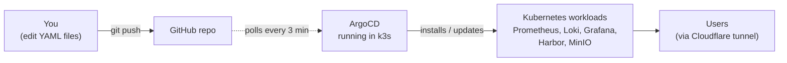

# Monitoring Infrastructure

A self-hosted observability and container registry stack for ~15 projects, deployed automatically by **ArgoCD** from this Git repository.

> [!NOTE]
> **New to DevOps or Kubernetes?** Start with [docs/concepts.md](docs/concepts.md) — it explains what every piece of the puzzle is (Kubernetes, k3s, ArgoCD, Helm, GitOps) in plain English, then come back here.

---

## What this gives you

| Need                                             | Tool                                              |
|--------------------------------------------------|---------------------------------------------------|
| Collect metrics from servers + apps              | **Prometheus** (15-day retention)                 |
| Collect logs from servers + apps                 | **Loki** + **Promtail** (7-day retention)         |
| See dashboards + search logs                     | **Grafana**                                       |
| Get alerts in Slack/Email when something breaks  | **Alertmanager**                                  |
| Store Docker images privately                    | **Harbor**                                        |
| Object storage for log chunks                    | **MinIO**                                         |
| Deploy + auto-update everything from Git         | **ArgoCD**                                        |

All of this runs on **one Linux server** with k3s (a lightweight Kubernetes), exposed to the outside world through a **Cloudflare tunnel** (no public ports needed on your server).

---

## Who this is for

| If you are…                              | Read this first                                |
|------------------------------------------|------------------------------------------------|
| New to Kubernetes or GitOps              | [docs/concepts.md](docs/concepts.md)           |
| Just want to install it                  | [BOOTSTRAP.md](BOOTSTRAP.md)                   |
| Operating a running install              | [docs/runbook.md](docs/runbook.md)             |
| Curious how the pieces fit together      | [docs/architecture.md](docs/architecture.md)   |
| Looking up a term you don't know         | [docs/glossary.md](docs/glossary.md)           |
| Adding a new server to be monitored      | [agents/README.md](agents/README.md)           |
| Onboarding a new project (16th, 17th, …) | [examples/project-onboarding/](examples/project-onboarding/) |

---

## How it works (the big picture)



Translation: **you change a file in Git, push, and a few minutes later it's live on your server.** No SSH, no `kubectl apply`, no manual Helm commands.

---

## Repository layout

```
.
├── README.md              ← you are here
├── BOOTSTRAP.md           ← first-time install walkthrough
│
├── bootstrap/             ← scripts + manifest to install ArgoCD itself
├── apps/                  ← one ArgoCD "Application" per workload (declares: deploy this Helm chart with these values)
├── helm-values/           ← the actual Helm values for each chart (Prometheus, Grafana, etc.)
├── manifests/             ← raw Kubernetes manifests (namespaces, ConfigMaps)
├── alerting/              ← Prometheus alert rules (PrometheusRule CRDs)
├── secrets/               ← templates for credentials — real values are filled in on the server, never committed
│
├── agents/                ← what to install on the servers being monitored
├── examples/              ← copy-paste snippets (PM2 logs, project onboarding)
├── dashboards/            ← Grafana JSON dashboards
└── docs/                  ← architecture, runbook, concepts, glossary
```

> [!TIP]
> The directory you'll touch the most is **`helm-values/`** — that's where you tune Prometheus retention, Loki resource limits, etc. Edit a file, `git push`, ArgoCD does the rest.

---

## Get started

→ **[BOOTSTRAP.md](BOOTSTRAP.md)** — first-time install on a fresh k3s node. Allow ~30 minutes.

After that, day-to-day looks like:

```bash
vim helm-values/loki.yaml      # change something
git commit -am "loki: bump retention to 14d"
git push                       # ✨ ArgoCD reconciles, you're done
```

---

## Repo URL — change if you fork

All ArgoCD Applications point at:

```
https://github.com/simon-appwrk/monitoring-infrastructure
```

If you fork, search-and-replace this URL across [bootstrap/root-app.yaml](bootstrap/root-app.yaml) and [apps/*.yaml](apps/).
