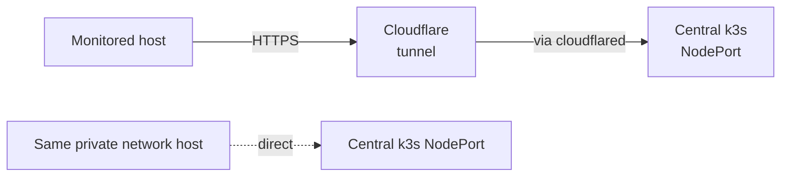

# Agents — making other servers visible to this stack

This folder is for **the servers being monitored**, not for the central k3s cluster. If you're setting up the central cluster itself, you don't need anything here — see [BOOTSTRAP.md](../BOOTSTRAP.md).

> [!NOTE]
> "Agent" = a small process running on each server you want to monitor, that ships metrics + logs to the central stack. We use **`node_exporter`** (metrics) and **Promtail** (logs).

---

## What every monitored host runs

| Tool          | Always? | What it does                               |
|---------------|---------|--------------------------------------------|
| `node_exporter` | Yes  | Exposes host metrics (CPU, RAM, disk, network) on port 9100. Prometheus scrapes it. |
| Promtail      | Yes     | Tails log files, pushes to Loki with labels. |
| cAdvisor      | Only on Docker hosts | Exposes container metrics on port 8080. |

---

## Pick your deployment style

| If the host is…                 | Use this folder                          |
|---------------------------------|------------------------------------------|
| A Linux VM or VPS               | [systemd/](systemd/) — native binaries   |
| A Docker host (no K8s)          | [docker-compose/](docker-compose/) — agents as containers |
| A K8s cluster (other than central) | [k8s-promtail/](k8s-promtail/) — DaemonSet |
| Many hosts at once              | [ansible/](ansible/) — one playbook does the lot |

---

## How an agent finds the central stack



Two ways:

| Path                                | URL pattern                                              |
|-------------------------------------|----------------------------------------------------------|
| **Via Cloudflare** (default)        | `https://loki-push.<your-domain>/loki/api/v1/push`       |
| **Direct** (if same private network) | `http://<central-node-ip>:30100/loki/api/v1/push`        |

Configure this in the agent's environment file (e.g. `/etc/promtail/env`).

---

## Required labels — every host MUST set these

When configuring Promtail on a host, set these env vars:

| Env var       | Example       | Why                                            |
|---------------|---------------|------------------------------------------------|
| `PROJECT`     | `payment-api` | Maps logs to a Grafana folder + alert routing  |
| `ENVIRONMENT` | `production`  | One of: `production`, `staging`, `dev`         |
| `TEAM`        | `backend`     | Owning team — used for alert routing           |
| `HOSTNAME`    | `vm-app-01`   | Auto-populated; visible in Grafana             |
| `HOST_CLASS`  | `cloud-vm`    | One of: `cloud-vm`, `vps`, `docker-host`, `k8s-node` |
| `LOKI_URL`    | (see above)   | Where to push                                   |

> [!IMPORTANT]
> Promtail drops streams that don't have `project` set. If you forget the labels, your logs will silently disappear.

---

## After onboarding — verify

Run these from your laptop or the central node:

```bash
# Did Prometheus pick up the host's node_exporter?
curl -s http://<central-node>:30090/api/v1/targets \
  | jq '.data.activeTargets[] | select(.labels.instance | contains("<new-host>"))'

# Did logs arrive in Loki?
# In Grafana → Explore → Loki:
{host="<new-host>"}
```

If both return data within 60s, you're done.

---

## Removing a host

1. Stop the agents:
   ```bash
   systemctl disable --now node_exporter promtail   # systemd path
   # or
   docker compose down                              # docker path
   ```

2. If the host was added to `additional-scrape-configs` (a Secret in `obs-metrics`), edit + reapply:
   ```bash
   # Edit your local copy of the scrape configs
   # then re-create the Secret
   kubectl -n obs-metrics create secret generic additional-scrape-configs \
     --from-file=prometheus-additional.yaml=/path/to/scrape-configs.yaml \
     --dry-run=client -o yaml | kubectl apply -f -
   # Roll Prometheus to reload
   kubectl -n obs-metrics rollout restart statefulset prometheus-kps-kube-prometheus-stack-prometheus
   ```

3. Loki retention (7d) will age out old log streams naturally.
