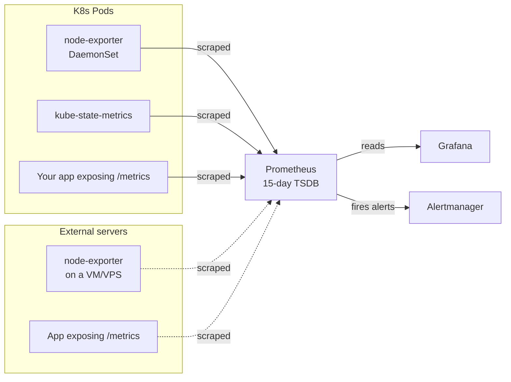
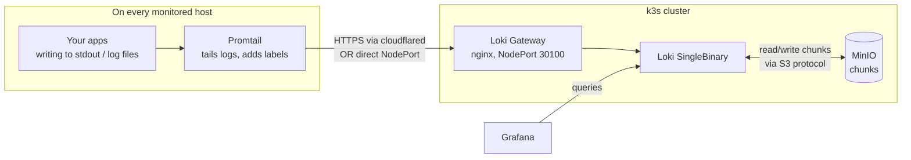
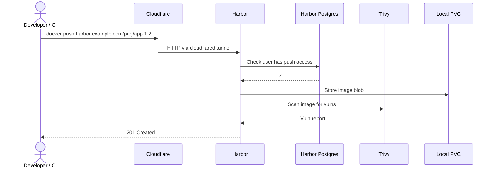
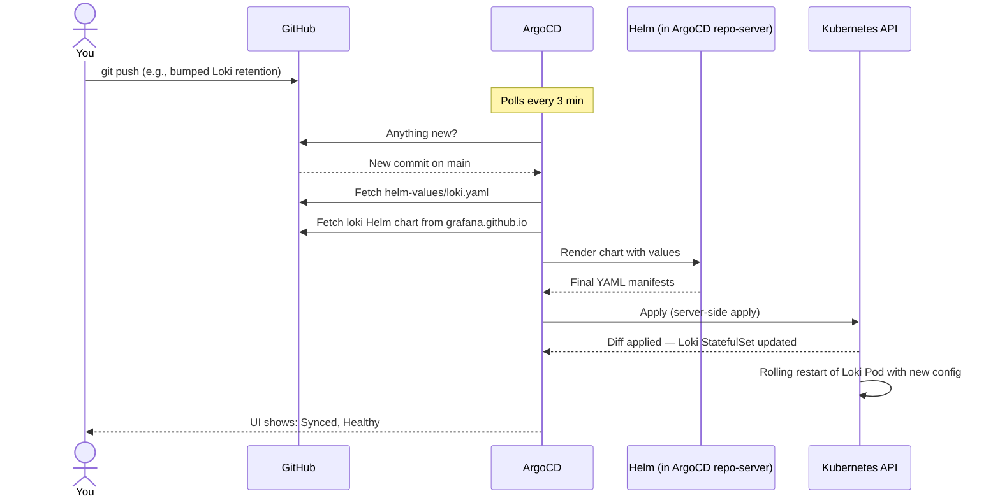
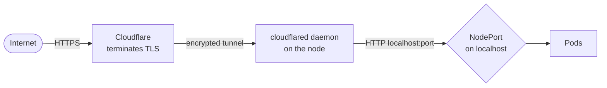

# Architecture

How this stack actually works once it's running.

> [!NOTE]
> If terms like Pod, Service, NodePort, or Helm chart are unfamiliar, read [concepts.md](concepts.md) first.

---

## Table of contents

1. [The big picture](#the-big-picture)
2. [What runs where](#what-runs-where)
3. [How metrics flow](#how-metrics-flow)
4. [How logs flow](#how-logs-flow)
5. [How alerts flow](#how-alerts-flow)
6. [How images flow](#how-images-flow)
7. [How GitOps flows](#how-gitops-flows)
8. [Network topology + NodePort table](#network-topology--nodeport-table)
9. [Storage model](#storage-model)
10. [Why we made certain trade-offs](#why-we-made-certain-trade-offs)

---

## The big picture

```mermaid
flowchart TB
    subgraph cf[☁️ Cloudflare]
        Tunnel[Cloudflare<br/>Tunnel]
    end

    subgraph node[🖥️ Single k3s node]
        subgraph argons[Namespace: argocd]
            Argo[ArgoCD]
        end
        subgraph metricsns[Namespace: obs-metrics]
            Prom[Prometheus]
            AM[Alertmanager]
            Graf[Grafana]
            KSM[kube-state-metrics]
            NE[node-exporter]
        end
        subgraph logsns[Namespace: obs-logs]
            Loki[Loki<br/>SingleBinary]
            LokiGW[Loki Gateway<br/>nginx]
        end
        subgraph storagens[Namespace: obs-storage]
            Minio[MinIO]
        end
        subgraph regns[Namespace: obs-registry]
            HarborCore[Harbor Core]
            HarborReg[Harbor Registry]
            HarborDB[Harbor Postgres]
        end
        CFD[cloudflared<br/>daemon]
    end

    GH[GitHub repo] -.->|polled| Argo
    Argo -->|installs| metricsns
    Argo -->|installs| logsns
    Argo -->|installs| storagens
    Argo -->|installs| regns

    Loki <-->|S3 protocol| Minio

    Prom -->|fires alerts| AM
    Loki -->|fires log alerts| AM

    Graf -->|reads| Prom
    Graf -->|reads| LokiGW

    Tunnel --> CFD --> node
    Slack[💬 Slack / Email / Telegram] <-- AM
    Hosts[🖥️ Other servers<br/>node_exporter, Promtail] -->|push logs| LokiGW
    Hosts -->|scraped by| Prom

    Users[👥 Users] --> Tunnel
```

Three things to notice:

1. **Everything runs on one node.** k3s, ArgoCD, all the workloads. Simple.
2. **Cloudflare tunnel is the only public entrance.** No ports exposed on your server's public IP. cloudflared makes outbound connections to Cloudflare; users connect to Cloudflare; Cloudflare proxies through the tunnel to the right NodePort.
3. **ArgoCD is the source of truth.** Every workload was installed by ArgoCD, reading this Git repo.

---

## What runs where

| Namespace      | What's in it                                            | Why                              |
|----------------|---------------------------------------------------------|----------------------------------|
| `argocd`       | ArgoCD (server, repo-server, controller, redis)         | The GitOps engine                |
| `obs-metrics`  | Prometheus, Alertmanager, Grafana, node-exporter, kube-state-metrics, prometheus-operator | Everything metrics-related       |
| `obs-logs`     | Loki (single binary), Loki gateway (nginx)              | Everything logs-related          |
| `obs-storage`  | MinIO (single replica)                                  | S3-compatible storage for Loki   |
| `obs-registry` | Harbor (core, registry, jobservice, portal, db, redis, trivy) | Private Docker image registry |

> [!TIP]
> **Why namespaces?** Two reasons. (1) RBAC — you can give a user access to one namespace without seeing others. (2) Sanity — `kubectl get pods -n obs-logs` is much easier to read than `get pods --all-namespaces` filtered by label.

---

## How metrics flow



### Step-by-step

1. **Targets expose `/metrics`** in the [Prometheus exposition format](https://prometheus.io/docs/instrumenting/exposition_formats/). For us:
   - **In-cluster:** `node-exporter` (DaemonSet — one per K8s node, exposes host metrics) and `kube-state-metrics` (one Deployment, exposes K8s object state).
   - **External:** any VM/VPS with `node_exporter` running. See [agents/](../agents/).
   - **Apps:** your app, on whatever port, exposing `/metrics`.

2. **Prometheus scrapes them every 30s by default.** It learns about K8s targets via `kubernetes_sd_configs` (auto-discovery). External targets you list manually in an `additional-scrape-configs` Secret (created out-of-band — ArgoCD doesn't manage scrape configs).

3. **Data lands in the Prometheus TSDB** (time-series database) on a 25 GiB PVC. Retention: 15 days, then auto-deleted.

4. **Grafana queries Prometheus** via its in-cluster Service URL (`http://kps-kube-prometheus-stack-prometheus.obs-metrics.svc:9090`).

5. **Alert rules** (defined as PrometheusRule CRDs in [alerting/](../alerting/)) are evaluated every 30s. If an alert fires, Prometheus sends it to Alertmanager.

> [!IMPORTANT]
> **Multi-tenancy via labels.** Every metric has a `project` label (set on the scrape job for external targets, derived from K8s Pod labels for in-cluster targets). All "developer can only see their project" enforcement is built on this label.

---

## How logs flow



### Step-by-step

1. **Promtail tails files** — `/var/log/*`, Docker container logs, K8s Pod logs, PM2 logs (if configured).

2. **Promtail adds required labels** to every log stream: `project`, `environment`, `team`. Plus optional ones: `service`, `host`, `level`. These labels are how you filter in Grafana.

3. **Promtail pushes to Loki** via HTTPS through cloudflared (`https://loki-push.<your-domain>/loki/api/v1/push`) or via NodePort 30100 if it's on the same private network as the cluster.

4. **Loki's gateway** (nginx) is the entry point. It forwards writes to the Loki SingleBinary Pod.

5. **Loki stores chunks in MinIO** via the S3 protocol. Index lives on the local PVC; chunks (the actual log content) in MinIO.

6. **Grafana queries Loki** via Explore or via dashboards.

7. **Retention: 7 days.** Loki's compactor deletes chunks older than 7d.

> [!NOTE]
> **Why Loki and not ELK / Splunk?** Loki indexes only labels, not log content. That makes it cheap to run (no Elasticsearch), but means searches use grep-style filters (`{project="foo"} |= "ERROR"`) rather than full-text indexes. Trade-off: cheaper, simpler, but slower for ad-hoc text search.

---

## How alerts flow

```mermaid
flowchart LR
    Prom[Prometheus<br/>evaluates rules every 30s]
    LokiR[Loki Ruler<br/>evaluates log-based rules]
    AM[Alertmanager<br/>routing tree]

    Prom -->|fires| AM
    LokiR -->|fires| AM

    AM -->|matches: project=infra| Slack1[#infra-oncall]
    AM -->|matches: env=prod, sev=critical| Slack2["#alerts-{team}"]
    AM -->|matches: env=prod, sev=critical| Email[oncall@team.com]
    AM -->|matches: env=staging| Slack3["#alerts-{team}-staging"]
    AM -.->|info severity| Drop[(silently dropped)]
```

### Routing logic

The full routing tree is in [helm-values/kube-prometheus-stack.yaml](../helm-values/kube-prometheus-stack.yaml) under `alertmanager.config.route`. Summary:

| Match condition                                  | Route                                      |
|--------------------------------------------------|--------------------------------------------|
| `severity = info`                                | dropped (visible in UI only)               |
| `team = unrouted`                                | platform team Slack (these are bugs)       |
| `project = infra` + `severity = critical`        | platform Slack + email                     |
| `environment = production` + `severity = critical` | team Slack + team email + Telegram bridge  |
| `environment = production` + `severity = warning`  | team Slack only                            |
| `environment = staging` + `severity = critical`    | team Slack only                            |

Webhook URLs and SMTP password live in the `alertmanager-webhooks` Secret (applied manually, never in Git).

> [!CAUTION]
> Every PrometheusRule must have `project`, `environment`, `team`, and `severity` labels. Rules missing these get caught by the `team=unrouted` catch-all that pages the platform team — that's intentional, treat it as a bug to fix.

---

## How images flow



Harbor uses a **local PVC** for image blobs (not MinIO) — keeps the credential graph simple. PVC is 20 GiB by default.

For pulls (deployments, CI):

```bash
docker pull harbor.example.com/payment-api/api:1.4.2
```

Same path in reverse. RBAC enforced via Harbor's Project + Member model (and eventually Keycloak group sync once OIDC is wired up).

---

## How GitOps flows



### Sync waves

`apps/*.yaml` filenames are prefixed with numbers (`10-`, `20-`, …) but the actual ordering comes from this annotation on each Application:

```yaml
metadata:
  annotations:
    argocd.argoproj.io/sync-wave: "10"
```

Lower waves go first. Our order:

| Wave | Application                    | Why this order            |
|------|--------------------------------|---------------------------|
| 0    | namespaces                     | Everything else needs them|
| 10   | minio                          | Loki depends on it        |
| 20   | loki                           | Grafana datasource        |
| 30   | kube-prometheus-stack          | Grafana datasource; CRDs needed by 60 |
| 40   | grafana                        | Reads from 20 + 30        |
| 50   | harbor                         | Independent               |
| 60   | alerting-rules + loki-ruler    | Need Prometheus + Loki up first |

---

## Network topology + NodePort table

> [!IMPORTANT]
> All public access goes through Cloudflare tunnel — your server has **no exposed public ports**. NodePorts are only reachable from inside the node, or via the cloudflared tunnel.



| Service          | NodePort | Tunnel publicly?           | Cloudflare hostname (example) |
|------------------|----------|----------------------------|-------------------------------|
| ArgoCD UI        | 30040    | yes                        | `argocd.example.com`          |
| Grafana          | 30030    | yes                        | `grafana.example.com`         |
| Prometheus UI    | 30090    | admin-only (or skip)       | `prometheus.example.com`      |
| Alertmanager UI  | 30093    | admin-only (or skip)       | `alertmanager.example.com`    |
| Loki push        | 30100    | yes (agents push from outside) | `loki-push.example.com`   |
| Loki query       | 30101    | no (Grafana proxies internally) | —                        |
| MinIO S3 API     | 30900    | no (intra-cluster only)    | —                             |
| MinIO console    | 30901    | admin-only                 | `minio.example.com`           |
| Harbor (HTTP)    | 30002    | yes                        | `harbor.example.com`          |

### cloudflared `config.yml` sketch

```yaml
tunnel: <tunnel-id>
credentials-file: /etc/cloudflared/<tunnel-id>.json

ingress:
  - hostname: argocd.example.com
    service: http://localhost:30040
  - hostname: grafana.example.com
    service: http://localhost:30030
  - hostname: harbor.example.com
    service: http://localhost:30002
  - hostname: loki-push.example.com
    service: http://localhost:30100
  - service: http_status:404      # catch-all
```

> [!TIP]
> Once cloudflared is running, set `externalURL` in [helm-values/harbor.yaml](../helm-values/harbor.yaml) and `root_url` in [helm-values/grafana.yaml](../helm-values/grafana.yaml) to your real Cloudflare hostnames so generated links work.

---

## Storage model

All PVCs use the **`local-path`** StorageClass — k3s creates a directory under `/var/lib/rancher/k3s/storage/` on the host and mounts it. Cheap, simple, no external storage system.

| Component   | PVC size | Stores                    |
|-------------|----------|---------------------------|
| Prometheus  | 25 Gi    | TSDB (15-day metrics)     |
| Loki        | 5 Gi     | boltdb-shipper index cache (chunks live in MinIO) |
| MinIO       | 30 Gi    | Loki chunks (compressed log batches) |
| Harbor blobs | 20 Gi   | Docker image layers       |
| Harbor DB   | 10 Gi    | Postgres (users, projects, scan results) |
| Harbor Redis | 5 Gi    | Job queue, cache          |
| Grafana     | 5 Gi     | sqlite (users, prefs, dashboard provisioning state) |

**Total:** ~100 Gi requested. **Free on your node:** 96 Gi. Tight — see [runbook.md](runbook.md) for what to trim.

> [!CAUTION]
> **No backup, by design.** This is monitoring data — accept loss on rebuild. Dashboards, alert rules, and configuration are in Git, so the *important* stuff is recoverable. If you ever need image-blob backup or Prometheus historical retention, push that to a different system (S3, Thanos, etc.) — out of scope for this design.

---

## Why we made certain trade-offs

<details>
<summary><strong>Why NodePort + cloudflared instead of an Ingress controller?</strong></summary>

- **Direct.** `curl localhost:30090` on the node works. No "what's the Ingress doing?" debugging.
- **TLS handled by Cloudflare.** No cert-manager, no Let's Encrypt, no certificate rotation.
- **No public ports on your server.** cloudflared makes outbound-only connections.
- **Trade-off:** You manually coordinate NodePorts. The table in this doc is the source of truth.

</details>

<details>
<summary><strong>Why ArgoCD instead of plain `helm install`?</strong></summary>

- **Single source of truth.** Whatever's in Git == what's running. No drift.
- **Reproducible.** Bootstrap a new server: install ArgoCD, point it at this repo, walk away.
- **Auditable.** Every change is a Git commit.
- **Trade-off:** One more component to install (ArgoCD itself, ~700 Mi RAM).

</details>

<details>
<summary><strong>Why Loki SingleBinary mode instead of microservices mode?</strong></summary>

- **Simpler.** One Pod that does everything (writes, reads, indexing).
- **Sized for a single node.** Distributed Loki (with read/write/backend Pods) is overkill at our scale.
- **Trade-off:** Won't scale beyond a single moderately-loaded node. We'd have to switch modes if log volume grew 10×.

</details>

<details>
<summary><strong>Why MinIO standalone instead of distributed?</strong></summary>

- **Single-node cluster.** Distributed MinIO needs 4+ nodes for erasure coding.
- **Trade-off:** No data redundancy. If the disk dies, logs are gone. We accept this since logs are 7-day retention and not critical history.

</details>

<details>
<summary><strong>Why Harbor on a local PVC, not MinIO?</strong></summary>

- **One less credential to coordinate.** Harbor → MinIO required a shared S3 access key. Local PVC needs none.
- **Trade-off:** ~20 Gi extra disk usage in obs-registry instead of consolidated in MinIO.

</details>

<details>
<summary><strong>Why secrets are NOT in Git (no SealedSecrets)?</strong></summary>

- **Simplest possible model.** Templates are committed; real values are applied with `kubectl apply` once.
- **No extra controller** (sealed-secrets-controller, ESO, etc.).
- **Trade-off:** Secrets aren't auditable through Git. Disaster recovery requires the secrets backup separately. For a single-cluster single-team deployment, this is the right trade.

</details>
