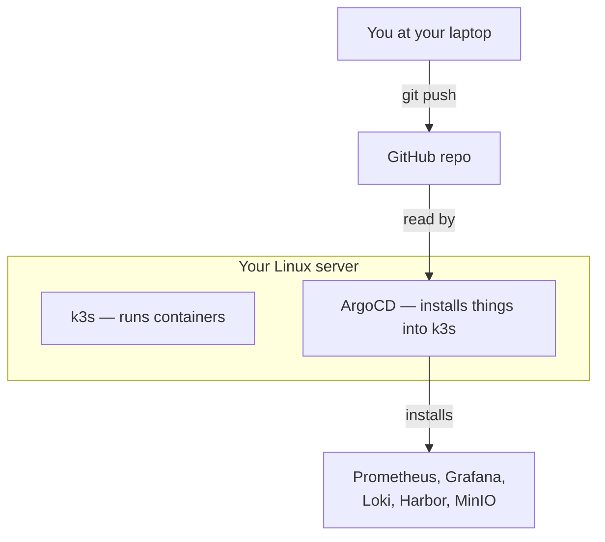
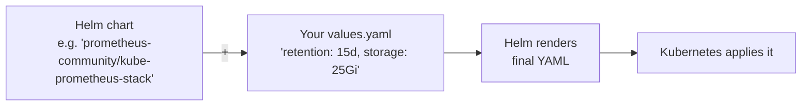
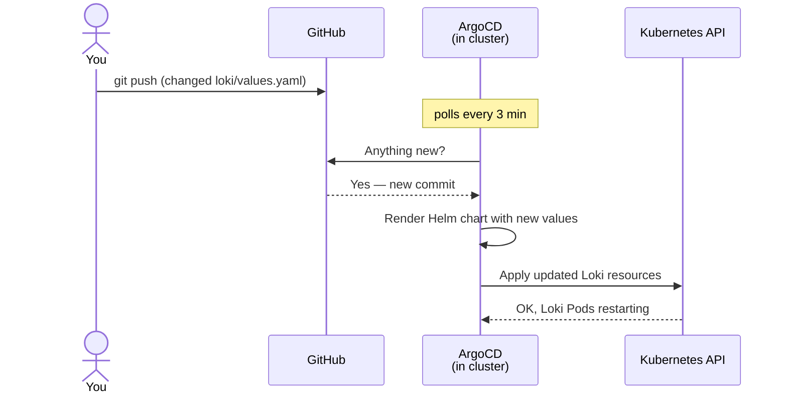
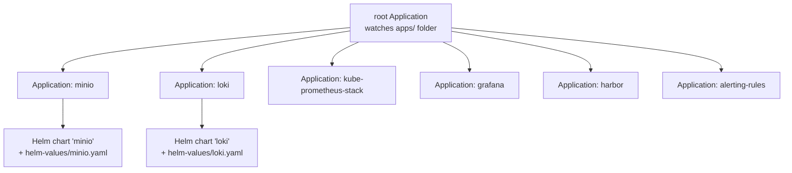
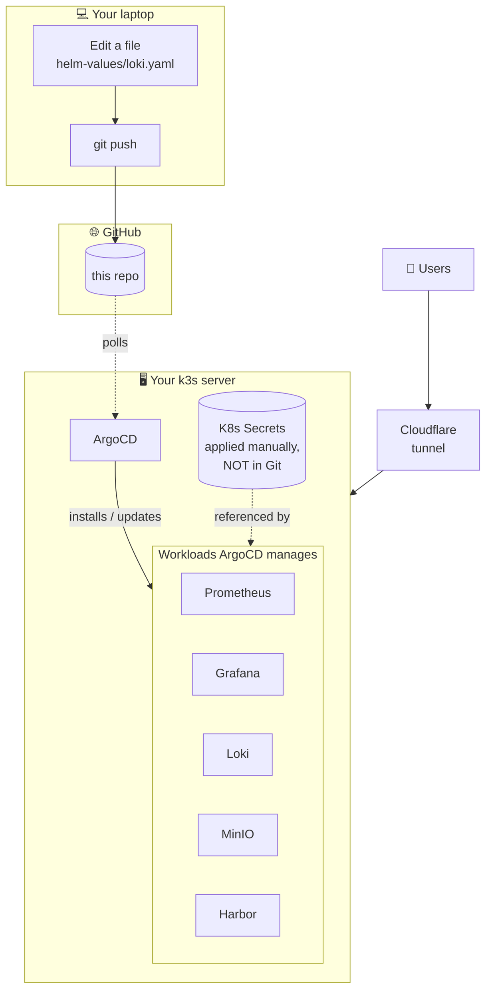

# Concepts — what every piece of this stack actually is

> [!NOTE]
> This page is for someone new to Kubernetes / DevOps. If you already know what Kubernetes, Helm, and ArgoCD are, skip to [architecture.md](architecture.md).

---

## Table of contents

1. [The 30-second mental model](#the-30-second-mental-model)
2. [What is a container?](#what-is-a-container)
3. [What is Kubernetes?](#what-is-kubernetes)
4. [What is k3s?](#what-is-k3s)
5. [What is Helm?](#what-is-helm)
6. [What is GitOps?](#what-is-gitops)
7. [What is ArgoCD?](#what-is-argocd)
8. [How they all fit together in this repo](#how-they-all-fit-together-in-this-repo)
9. [Vocabulary cheat-sheet](#vocabulary-cheat-sheet)

---

## The 30-second mental model

You write YAML in Git. ArgoCD reads Git. ArgoCD makes your server match what's in Git. Done.

---

## What is a container?

A **container** is a tiny, sealed package containing an app and everything it needs to run (libraries, config, files). It's like a single, self-contained `.exe` for Linux. Docker is the most famous tool for building and running containers.

> Real-world: when you do `docker run nginx`, you start a container holding the nginx web server. Stop it, the web server vanishes. No leftovers.

---

## What is Kubernetes?

**Kubernetes** (K8s) is software that runs many containers across many servers, restarts them when they crash, gives them IP addresses, lets them find each other, etc. Think of it as an operating system for containers.

Key Kubernetes objects you'll see in this repo:

| Object         | What it is (in one sentence)                                                       |
|----------------|------------------------------------------------------------------------------------|
| **Pod**        | A running container (or a small group of containers running together).             |
| **Deployment** | A spec saying "I want N copies of this Pod running, always."                       |
| **Service**    | A stable in-cluster IP/DNS name pointing at the Pods (because Pods come and go).   |
| **NodePort**   | A flavor of Service that opens a port on the host machine itself.                  |
| **Namespace**  | A folder. `obs-metrics`, `obs-logs`, etc. — used to group related things together. |
| **Secret**     | A K8s object holding sensitive data (passwords, API keys).                         |
| **ConfigMap**  | Same as Secret, but for non-sensitive config (rule files, settings).               |
| **PVC**        | "Persistent Volume Claim" — disk storage for a Pod that survives Pod restarts.     |
| **CRD**        | "Custom Resource Definition" — a way to teach Kubernetes new object types.         |

> [!TIP]
> When something is broken, 90% of the time `kubectl get pods -n <namespace>` and `kubectl describe pod <name> -n <namespace>` tell you why.

---

## What is k3s?

**k3s** is a lightweight Kubernetes distribution that fits on small servers (your 7.7 Gi RAM box can run it). It's *real* Kubernetes, just packaged as a single binary with sensible defaults.

It also bundles a few things automatically:

- A storage class called **`local-path`** — when a Pod asks for a PVC, k3s creates a directory on the host and mounts it. Cheap, simple, no external storage needed.
- An ingress controller (Traefik) — we don't use it, since we expose services via NodePort + Cloudflare tunnel.

---

## What is Helm?

**Helm** is the package manager for Kubernetes. A "Helm chart" is a bundle of pre-written Kubernetes YAML for a specific application (like Prometheus or Grafana), with knobs you can tune via a **`values.yaml`** file.

> Real-world: instead of writing 200 YAML files for Prometheus from scratch, you grab the official chart and write 30 lines of `values.yaml` saying how you want it configured. Helm does the rest.

---

## What is GitOps?

**GitOps** is a way of managing infrastructure where:

1. **The desired state of the system lives in Git.** (Not in someone's head, not in `kubectl history`, not in a wiki.)
2. **A controller running in the cluster constantly reconciles reality with Git.** If they drift, it fixes it.

Benefits:

- **Auditable** — every change is a Git commit with author + timestamp + diff.
- **Reproducible** — you can rebuild the entire stack on a new server by pointing the controller at the same repo.
- **Reversible** — `git revert` is a deploy.
- **No SSH-and-fix-it-live** — the cluster matches Git, always.

---

## What is ArgoCD?

**ArgoCD** is a GitOps controller for Kubernetes. It runs as a Pod in your cluster, watches a Git repo, and applies anything it finds there.

You hand it an **Application** object — a small YAML that says "watch this path in this repo and apply whatever Kubernetes manifests are there." ArgoCD does the rest.

### App-of-apps pattern

We use a pattern called **app-of-apps**:

1. You apply ONE thing manually: a "root" Application.
2. The root Application points at the `apps/` folder in this repo.
3. `apps/` contains many other Application files — one per workload (MinIO, Loki, Prometheus, etc.).
4. ArgoCD discovers each of them and creates them. Now ArgoCD manages itself, mostly.

### Sync waves

Some things must come up before others (Loki needs MinIO running before it can store chunks, Grafana needs Prometheus to point at, etc.). We use ArgoCD **sync waves** — an annotation on each Application telling ArgoCD "wave 10 first, then 20, then 30." See [apps/](../apps/).

---

## How they all fit together in this repo

The boundary between "in Git" and "not in Git":

| In Git (everything reproducible)              | NOT in Git (secrets only)                          |
|-----------------------------------------------|----------------------------------------------------|
| Helm values, ArgoCD Apps, alert rules         | Passwords, API keys, webhook URLs                  |
| Dashboards, namespace definitions             | Created on the server with `kubectl apply`         |
| Documentation                                 | Templates for them ARE in Git as `*.yaml.example`  |

If your server burns down, you can restore from Git **plus** re-applying the secrets — that's it.

---

## Vocabulary cheat-sheet

For the full list, see [glossary.md](glossary.md). Quick highlights:

| Term            | One-liner                                                            |
|-----------------|----------------------------------------------------------------------|
| **Pod**         | A running container (the smallest thing K8s schedules)               |
| **Namespace**   | A folder for organizing K8s objects                                  |
| **Service**     | Stable network address for a set of Pods                             |
| **NodePort**    | A Service flavor that opens a port on the host machine               |
| **PVC**         | A claim on disk storage that survives Pod restarts                   |
| **Helm chart**  | A reusable package of K8s YAML with tunable values                   |
| **GitOps**      | Pattern: desired state in Git, controller reconciles cluster to it   |
| **ArgoCD**      | The GitOps controller we use                                         |
| **Application** | An ArgoCD object saying "deploy this from that Git path"             |
| **Sync wave**   | An annotation telling ArgoCD what order to deploy things in          |

---

## Next steps

- **Want to install it?** → [BOOTSTRAP.md](../BOOTSTRAP.md)
- **Want to understand the specifics of THIS stack?** → [architecture.md](architecture.md)
- **Want to operate a running cluster?** → [runbook.md](runbook.md)
