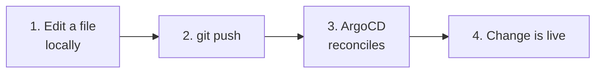
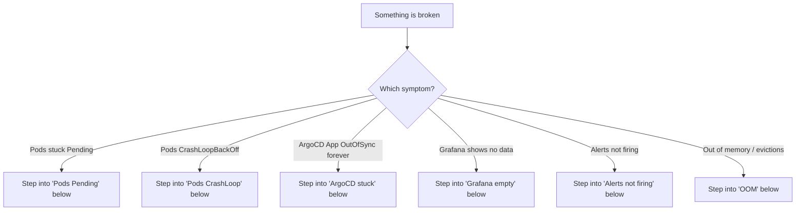
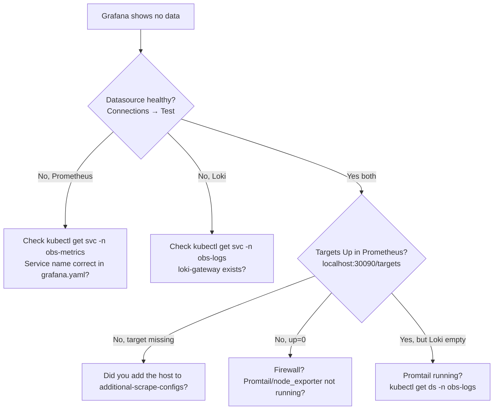
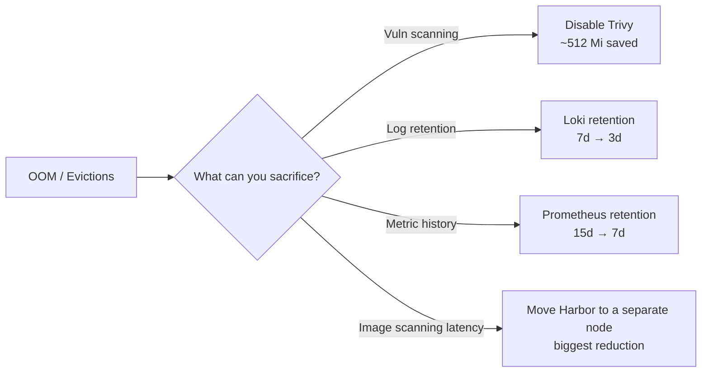

# Runbook

Day-2 operations: how to diagnose problems, change things, and not break anything.

> [!NOTE]
> If you've never touched Kubernetes before, read [concepts.md](concepts.md) first. This runbook assumes you understand Pods, Services, namespaces, and `kubectl`.

---

## Table of contents

1. [How to change anything in this stack](#how-to-change-anything-in-this-stack)
2. [Health checks](#health-checks)
3. [ArgoCD operations](#argocd-operations)
4. [Diagnosing common symptoms](#diagnosing-common-symptoms)
5. [Capacity tuning](#capacity-tuning)
6. [Restoring from a wipe](#restoring-from-a-wipe)
7. [Adding things](#adding-things)
8. [Rotating secrets](#rotating-secrets)

---

## How to change anything in this stack

The mental model:



| To do this…                        | Edit this file…                                 |
|------------------------------------|-------------------------------------------------|
| Change Loki retention              | [helm-values/loki.yaml](../helm-values/loki.yaml) — `loki.limits_config.retention_period` |
| Change Prometheus retention        | [helm-values/kube-prometheus-stack.yaml](../helm-values/kube-prometheus-stack.yaml) — `prometheus.prometheusSpec.retention` |
| Add a Prometheus alert             | New file `alerting/<name>.yaml` (PrometheusRule CRD) |
| Add a Loki log-based alert         | [manifests/loki-rules-configmap.yaml](../manifests/loki-rules-configmap.yaml) — add to the inline YAML |
| Bump a Pod's memory limit          | The component's file in `helm-values/`          |
| Change Grafana root URL            | [helm-values/grafana.yaml](../helm-values/grafana.yaml) — `grafana.ini.server.root_url` |
| Disable Harbor's vuln scanner      | [helm-values/harbor.yaml](../helm-values/harbor.yaml) — `trivy.enabled: false` |
| Add a new monitored host           | [agents/](../agents/) docs                      |

After editing:

```bash
git commit -am "loki: bump retention to 14d"
git push
```

ArgoCD picks it up within 3 minutes. To trigger immediately, click "Sync" in the ArgoCD UI on the affected Application.

> [!TIP]
> **Always commit-first, never `kubectl edit` directly.** If you `kubectl edit` something ArgoCD manages, ArgoCD will revert your change on the next sync. Edit Git, push, sync.

---

## Health checks

### Quick endpoint check (run on the node)

```bash
for n in 30040 30030 30090 30093 30100 30101 30900 30002; do
  printf "%5d  " "$n"
  curl -s -o /dev/null -w "%{http_code}\n" "http://localhost:$n/" || true
done
```

| Port | Should return |
|------|---------------|
| 30040 | 200 (ArgoCD) |
| 30030 | 302 (Grafana redirect to login) |
| 30090 | 302 (Prometheus) |
| 30093 | 200 (Alertmanager) |
| 30100 | 404 (Loki gateway, root path 404 is fine) |
| 30101 | 404 (Loki query, ditto) |
| 30900 | 403 (MinIO S3 root requires auth) |
| 30002 | 200 (Harbor) |

`000` means nothing is listening — that workload didn't come up.

### Detailed health endpoints

| Service       | URL                                              |
|---------------|--------------------------------------------------|
| ArgoCD        | `http://localhost:30040/healthz`                 |
| Prometheus    | `http://localhost:30090/-/healthy`               |
| Alertmanager  | `http://localhost:30093/-/healthy`               |
| Grafana       | `http://localhost:30030/api/health`              |
| Loki          | `http://localhost:30100/ready`                   |
| MinIO         | `http://localhost:30900/minio/health/ready`      |
| Harbor        | `http://localhost:30002/api/v2.0/health`         |

### Pod check

```bash
kubectl get pods -A | grep -E "obs-|argocd"
```

All Pods should be `Running`, all containers Ready.

---

## ArgoCD operations

### See app state

```bash
# List all Applications
kubectl -n argocd get applications

# Detail on one
kubectl -n argocd describe application loki
```

In the UI, every Application shows two statuses:

| Status      | Meaning                                                       |
|-------------|---------------------------------------------------------------|
| **Synced**  | Cluster matches Git                                           |
| **OutOfSync** | Cluster differs from Git (a manual change, or sync hasn't run) |
| **Healthy** | All resources are working                                     |
| **Degraded** | Something's wrong (Pod crashing, PVC pending, etc.)          |
| **Progressing** | Mid-deployment                                            |

### Force a sync (skip the 3-min wait)

In the UI: click the Application → "Sync" → "Synchronize".

Via CLI:
```bash
kubectl -n argocd patch app loki --type merge -p '{"operation":{"sync":{}}}'
```

### Reset / re-sync everything

```bash
# Re-sync the root, which cascades to all child Apps
kubectl -n argocd patch app root --type merge -p '{"operation":{"sync":{}}}'
```

### Get the ArgoCD admin password

```bash
kubectl -n argocd get secret argocd-initial-admin-secret \
  -o jsonpath='{.data.password}' | base64 -d ; echo
```

If this Secret was deleted (it's auto-deleted after first use in some setups):

```bash
# Reset to a new auto-generated password
kubectl -n argocd patch secret argocd-secret -p '{"data": {"admin.password": null}}'
kubectl -n argocd rollout restart deploy argocd-server
# Wait ~30s, then re-fetch
```

---

## Diagnosing common symptoms

### Symptom → diagnosis tree



### "Pods stuck in Pending"

Almost always PVC binding (waiting for storage) or insufficient resources.

```bash
kubectl get pvc -A                                    # any 'Pending'?
kubectl describe pvc <name> -n <ns>                   # why?
kubectl describe pod <name> -n <ns> | tail -20        # 'FailedScheduling'?
kubectl -n kube-system get pods -l app=local-path-provisioner   # local-path running?
```

If the local-path provisioner Pod is gone, the PVC will never bind. Restart it:
```bash
kubectl -n kube-system rollout restart deploy local-path-provisioner
```

### "Pods stuck in CrashLoopBackOff"

```bash
# What's the Pod saying?
kubectl logs <pod> -n <ns> --tail=50

# What did the previous (crashed) instance say?
kubectl logs <pod> -n <ns> --previous --tail=50

# Why is K8s killing it?
kubectl describe pod <pod> -n <ns> | tail -30
```

Most common causes by Pod:

| Pod                 | Likely cause                                             |
|---------------------|----------------------------------------------------------|
| `loki-*`            | Can't reach MinIO, or MinIO user `loki` doesn't exist   |
| `prometheus-kps-*`  | Bad alert rule syntax (check `kubectl logs`), or OOM    |
| `grafana-*`         | Datasource Service URL wrong, or Secret missing         |
| `harbor-database-*` | PVC not bound, or wrong password in Secret              |
| Any                 | OOMKilled — see [capacity tuning](#capacity-tuning)     |

### "ArgoCD App OutOfSync forever"

Open the App in the UI. The failing resource is highlighted red. Click it for the K8s API error.

Common patterns:

- **"Failed to render Helm chart"** — bad YAML in `helm-values/`. Check syntax with `python -c "import yaml; yaml.safe_load(open('helm-values/loki.yaml'))"`.
- **"Forbidden"** — RBAC issue. ArgoCD's service account needs cluster-admin (it does, by default).
- **"Resource has reference to non-existent Secret"** — you forgot to `kubectl apply` a secret from `secrets/`.

### "Grafana shows no data"



### "Alerts not firing"

1. **Is the rule loaded?** `kubectl -n obs-metrics get prometheusrules`. Should list `infrastructure`, `containers`, `availability` plus any per-project rules.
2. **Is Prometheus evaluating it?** UI → Status → Rules. Red rules = parse error.
3. **Is the alert active?** UI → Alerts. If it's `Inactive`, the condition isn't met.
4. **Did Alertmanager receive it?** `http://localhost:30093/#/alerts`.
5. **Did the receiver fire?** Check Alertmanager logs:
   ```bash
   kubectl logs -n obs-metrics alertmanager-kps-kube-prometheus-stack-alertmanager-0 --tail=50
   ```
   Look for `error sending notification` lines — usually a wrong webhook URL or Slack throttling.

### "Loki: InvalidAccessKeyId"

The MinIO user `loki` doesn't exist. See [secrets/README.md](../secrets/README.md) → "After MinIO comes up — bootstrap MinIO users". Run that block, then bounce Loki.

### "Out of memory / Pod evictions"

See [capacity tuning](#capacity-tuning).

---

## Capacity tuning

The node has 7.7 Gi total RAM. Steady state usage ~6–7 Gi. When you hit the wall:



### Disable Trivy

```yaml
# helm-values/harbor.yaml
trivy:
  enabled: false
```

### Drop Loki retention

```yaml
# helm-values/loki.yaml
loki:
  limits_config:
    retention_period: 72h    # 3 days instead of 168h (7d)
```

Also shrink the PVC if you want to reclaim disk:
```yaml
singleBinary:
  persistence:
    size: 2Gi
```

> [!CAUTION]
> Shrinking a PVC isn't supported in-place. You have to delete the PVC (losing the data) and recreate. Acceptable for a cache PVC like Loki's, but be sure.

### Drop Prometheus retention

```yaml
# helm-values/kube-prometheus-stack.yaml
prometheus:
  prometheusSpec:
    retention: 7d
    retentionSize: "15GB"
```

### Disk pressure

```bash
df -h /var/lib/rancher/k3s/storage          # local-path's parent
kubectl get pvc -A                          # who's using what
du -sh /var/lib/rancher/k3s/storage/* | sort -h
```

Worst offenders are usually MinIO (Loki chunks) and Prometheus TSDB. Trim retention to free space.

---

## Restoring from a wipe

This stack is ephemeral by design. To rebuild from scratch:

1. Fresh k3s node (`curl -sfL https://get.k3s.io | sh -`)
2. `git clone` this repo
3. Re-do [BOOTSTRAP.md](../BOOTSTRAP.md) from Step 2

You **lose**: existing log data, recent metrics, Harbor image blobs, Grafana sqlite (recent dashboard edits made via UI but not exported to Git).

You **keep** (because they're in Git): all dashboards in `dashboards/`, all alert rules in `alerting/`, all Helm values, all configuration.

> [!TIP]
> **Make a habit of exporting any UI-created Grafana dashboards to a JSON file in `dashboards/` and committing it.** That way the dashboard survives a wipe.

---

## Adding things

### Add a new Prometheus alert

1. Create `alerting/<descriptive-name>.yaml`:

   ```yaml
   apiVersion: monitoring.coreos.com/v1
   kind: PrometheusRule
   metadata:
     name: <descriptive-name>
     namespace: obs-metrics
   spec:
     groups:
       - name: <group>
         rules:
           - alert: MyAlert
             expr: up{job="my-job"} == 0
             for: 5m
             labels:
               project: <name>
               environment: production
               team: <team>
               severity: critical
             annotations:
               summary: "..."
   ```

2. `git push` → ArgoCD picks it up.

3. Verify within 30s in Prometheus UI → Status → Rules.

> [!IMPORTANT]
> Every alert MUST have `project`, `environment`, `team`, and `severity` labels. Otherwise it falls through to the unrouted catch-all (which pages the platform team).

### Add a new Loki log-based alert

Edit [manifests/loki-rules-configmap.yaml](../manifests/loki-rules-configmap.yaml), add a rule under the `data:` block. Push. ArgoCD reconciles, the ConfigMap is updated, and Loki picks it up on its next ruler poll.

### Add a new Grafana dashboard

1. Create the dashboard in Grafana UI.
2. Share → Export → "Save to file" → grab the JSON.
3. Save to `dashboards/<descriptive-name>.json`.
4. Wrap as a ConfigMap so the Grafana sidecar picks it up:

   ```yaml
   # manifests/dashboard-<name>.yaml
   apiVersion: v1
   kind: ConfigMap
   metadata:
     name: dashboard-<name>
     namespace: obs-metrics
     labels:
       grafana_dashboard: "1"
     annotations:
       grafana_folder: "Infrastructure"   # or your project folder
   data:
     dashboard.json: |
       <paste JSON here, indented 6 spaces>
   ```

5. `git push`.

### Add a new monitored host

See [agents/README.md](../agents/README.md). Pick the deployment style (Ansible, docker-compose, systemd) for that host.

### Add a new project (16th, 17th, …)

See [examples/project-onboarding/](../examples/project-onboarding/).

---

## Rotating secrets

> [!NOTE]
> Reminder: secrets are NOT in Git. They live as K8s Secrets, applied via `kubectl apply` from the templates.

### Rotate Grafana admin password

```bash
# 1. Edit the local secret file on the server
vim ~/monitoring-infrastructure/secrets/grafana-admin.yaml
# change admin-password to the new value

# 2. Apply
kubectl apply -f ~/monitoring-infrastructure/secrets/grafana-admin.yaml

# 3. Restart Grafana so it re-reads the Secret
kubectl -n obs-metrics rollout restart deploy grafana
```

Same pattern for `harbor-admin`, `harbor-database`, etc.

### Rotate Loki's MinIO credentials

Trickier because both Loki AND MinIO need to be updated:

```bash
# 1. Update the K8s Secret
vim ~/monitoring-infrastructure/secrets/loki-s3.yaml          # new MINIO_SECRET_KEY
kubectl apply -f ~/monitoring-infrastructure/secrets/loki-s3.yaml

# 2. Update the MinIO user with the same new key
NEW_SK=$(kubectl -n obs-logs get secret loki-s3 -o jsonpath='{.data.MINIO_SECRET_KEY}' | base64 -d)
ROOT_USER=$(kubectl -n obs-storage get secret minio-root -o jsonpath='{.data.rootUser}' | base64 -d)
ROOT_PASS=$(kubectl -n obs-storage get secret minio-root -o jsonpath='{.data.rootPassword}' | base64 -d)
MINIO_POD=$(kubectl -n obs-storage get pod -l release=minio -o jsonpath='{.items[0].metadata.name}')

kubectl -n obs-storage exec "$MINIO_POD" -- env \
  ROOT_USER="$ROOT_USER" ROOT_PASS="$ROOT_PASS" NEW_SK="$NEW_SK" \
  bash -c '
mc alias set local http://localhost:9000 "$ROOT_USER" "$ROOT_PASS"
mc admin user add local loki "$NEW_SK"     # add re-creates with new password
mc admin policy attach local readwrite --user loki
'

# 3. Restart Loki to pick up the new env-var value
kubectl -n obs-logs delete pod -l app.kubernetes.io/name=loki
```

---

## When in doubt

```bash
# What's the cluster doing right now?
kubectl get pods -A
kubectl top pods -A
kubectl get events -A --sort-by=.lastTimestamp | tail -20

# What does ArgoCD think?
kubectl -n argocd get applications

# What does the failing Pod say?
kubectl logs <pod> -n <ns> --tail=100
kubectl describe pod <pod> -n <ns>
```

90% of incidents are diagnosed by reading these four sets of output.
