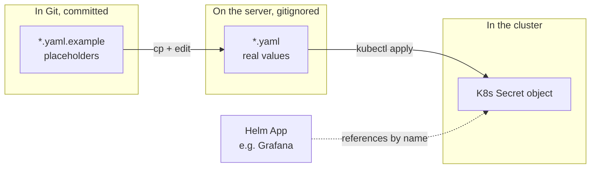
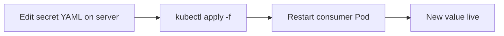

# Secrets

How sensitive credentials (passwords, webhook URLs, API keys) are managed in this repo.

> [!IMPORTANT]
> **Secrets never enter Git.** This is the deliberate model. ArgoCD does not manage them. You apply them once, manually, on the server.

---

## The mental model



| What | In Git? | Used how |
|------|---------|----------|
| `*.yaml.example` | yes (CHANGEME placeholders only) | starting point + documentation |
| `*.yaml` (real) | NO (gitignored) | created on the server, applied with `kubectl apply` |
| K8s Secret | n/a (lives in etcd) | referenced by Helm Apps via `existingSecret: foo` |

---

## What's in here

| File                                   | Becomes K8s Secret      | Namespace      | Used by                           |
|----------------------------------------|-------------------------|----------------|-----------------------------------|
| `minio-root.yaml`                      | `minio-root`            | `obs-storage`  | MinIO chart                       |
| `loki-s3.yaml`                         | `loki-s3`               | `obs-logs`     | Loki (env vars for AWS SDK)       |
| `grafana-admin.yaml`                   | `grafana-admin`         | `obs-metrics`  | Grafana chart                     |
| `grafana-oidc.yaml`                    | `grafana-oidc`          | `obs-metrics`  | Grafana — Keycloak client secret  |
| `harbor-admin.yaml`                    | `harbor-admin`          | `obs-registry` | Harbor chart                      |
| `harbor-database.yaml`                 | `harbor-database`       | `obs-registry` | Harbor internal Postgres          |
| `alertmanager-webhooks.yaml`           | `alertmanager-webhooks` | `obs-metrics`  | Alertmanager (mounted as files)   |

---

## First-time workflow (during BOOTSTRAP)

```bash
cd ~/monitoring-infrastructure/secrets

# 1. Copy every template to a real version
for f in *.yaml.example; do
  [[ ! -f "${f%.example}" ]] && cp "$f" "${f%.example}"
done

# 2. Edit each — replace every CHANGEME
vim minio-root.yaml          # rootPassword
vim loki-s3.yaml             # AWS_SECRET_ACCESS_KEY (becomes the MinIO 'loki' user's password)
vim grafana-admin.yaml       # admin-password
vim grafana-oidc.yaml        # placeholder OK if Keycloak isn't ready
vim harbor-admin.yaml        # HARBOR_ADMIN_PASSWORD
vim harbor-database.yaml     # POSTGRES_PASSWORD
vim alertmanager-webhooks.yaml  # slack-platform-url, smtp-password

# 3. Apply
bash apply.sh
```

> [!TIP]
> Generate strong passwords: `openssl rand -base64 32`

> [!CAUTION]
> **Cross-file consistency required:** the `AWS_SECRET_ACCESS_KEY` in `loki-s3.yaml` MUST equal the password you'll give to the MinIO `loki` user (next step). Pick a value, use it in both places.

---

## After MinIO comes up — bootstrap MinIO users

The MinIO Helm chart's user-creation Job is unreliable. We create the `loki` user manually, once. Run this **after** Step 6 of [BOOTSTRAP.md](../BOOTSTRAP.md), once the MinIO Pod is Ready.

```bash
ROOT_USER=$(kubectl -n obs-storage get secret minio-root -o jsonpath='{.data.rootUser}' | base64 -d)
ROOT_PASS=$(kubectl -n obs-storage get secret minio-root -o jsonpath='{.data.rootPassword}' | base64 -d)
LOKI_AK=$(kubectl -n obs-logs    get secret loki-s3     -o jsonpath='{.data.AWS_ACCESS_KEY_ID}'     | base64 -d)
LOKI_SK=$(kubectl -n obs-logs    get secret loki-s3     -o jsonpath='{.data.AWS_SECRET_ACCESS_KEY}' | base64 -d)

MINIO_POD=$(kubectl -n obs-storage get pod -l release=minio -o jsonpath='{.items[0].metadata.name}')

kubectl -n obs-storage exec "$MINIO_POD" -- env \
  ROOT_USER="$ROOT_USER" ROOT_PASS="$ROOT_PASS" \
  LOKI_AK="$LOKI_AK"     LOKI_SK="$LOKI_SK" \
  bash -e <<'EOF'
mc alias set local http://localhost:9000 "$ROOT_USER" "$ROOT_PASS"
mc admin user add    local "$LOKI_AK" "$LOKI_SK"        2>/dev/null || true
mc admin policy attach local readwrite --user "$LOKI_AK" 2>/dev/null || true
for b in loki-chunks loki-ruler loki-admin; do
  mc mb -p "local/$b" 2>/dev/null || true
done
mc admin user ls local
mc ls local
EOF

# Bounce Loki to retry S3 with the now-valid user
kubectl -n obs-logs delete pod -l app.kubernetes.io/name=loki
```

This is also documented in [BOOTSTRAP.md](../BOOTSTRAP.md) Step 7.

---

## Adding a new secret later

Three steps:

1. **Commit a template.** Create `secrets/<name>.yaml.example` with `CHANGEME` placeholder values. This documents the secret's structure.

2. **On the server:** copy + fill in.
   ```bash
   cp secrets/<name>.yaml.example secrets/<name>.yaml
   vim secrets/<name>.yaml          # fill in real values
   kubectl apply -f secrets/<name>.yaml
   ```

3. **Reference from a Helm value or other manifest.** Use `existingSecret: <name>` (in chart values) or `secretRef: <name>` (in raw manifests).

---

## Rotating a secret



```bash
vim secrets/<name>.yaml                                       # change the value
kubectl apply -f secrets/<name>.yaml                          # update the Secret
kubectl -n <namespace> rollout restart deploy/<consumer>      # pick up the new value
```

> [!NOTE]
> Some workloads watch their Secrets and reload automatically (Loki, Grafana). Others (most Helm charts) need a Pod restart. When in doubt, restart.

---

## Why no SealedSecrets / SOPS / Vault?

Trade-off documented in [docs/architecture.md](../docs/architecture.md#why-we-made-certain-trade-offs). Short version:

- Adding sealed-secrets-controller / external-secrets-operator means another moving piece.
- For a single-cluster single-team deployment, manual `kubectl apply` is the simplest model that works.
- If you outgrow this (multiple clusters, regulatory requirements), swap in SealedSecrets — the Helm Apps wouldn't change, only how the Secret object got into the cluster.

---

## What's gitignored

The `.gitignore` has:

```
secrets/*.yaml
!secrets/*.yaml.example
```

That means: ignore every `*.yaml` in this folder EXCEPT `*.yaml.example`. So:

- `secrets/minio-root.yaml.example` → committed ✓
- `secrets/minio-root.yaml` → ignored ✓

Verify with:

```bash
git check-ignore secrets/minio-root.yaml
# Should output: secrets/minio-root.yaml (proving it IS ignored)
```
